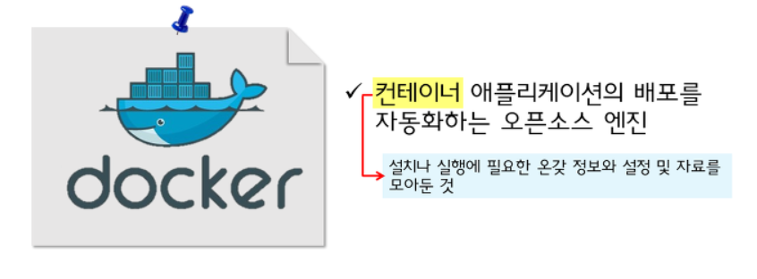
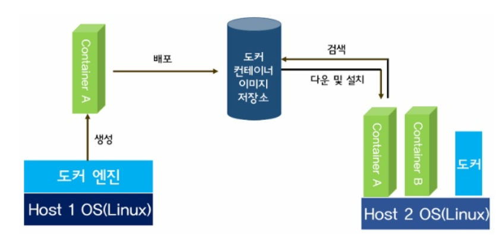

# <b> Docker info </b>

최근 들어 모바일 환경이 강조되고 글로벌 서비스가 많아지면서 빠르고 민첩하게 원하는 서비스를 만들어야 하는 요구가 높아지고 이를 위한 인프라 관리 중요성도 강조되면서 cloud가 인기를 끌었다.

## <b> Could 란 ? </b>

> 클라우드란 인터넷 상의 유틸리티 데이터 서버에 프로그램을 두고 필요할 때 컴퓨터나 휴대폰 등에 불러와서 사용하는 웹에 기반한 소프트웨어 서비스를 말한다. 일반적인 클라우드 컴퓨팅에서 소프트웨어와 데이터는 서버에 저장된다.  
> 쉽게 말해, 정보는 인터넷 상의 서버에 영구적으로 저장되고 데스크탑이나 테이블 컴퓨터, 노트북, 벽걸이 컴퓨터, 휴대용 기기 등과 같은 클라이언트에는 일시적으로 보관되어 사용되는 원리이다.  
> 도커는 이러한 \*\*클라우드 원리를 이용하여 개발에 있어서 빠르고 편리함을 위해 고안된 기술\*\* 이다. 

## <b> Docker </b>

도커는 오픈소스 프로젝트명인 동시에 기업명이다.

도커는 기본적으로 "컨테이너"라고 부르는 애플리케이션 자동화 기술을 좀 더 "쉽게" 사용할 수 있도록 만들어졌다.

 \*\* 컨터이너란 설치나 실행에 필요한 온갖 정보와 설정, 자료를 한군데 모아둔 것을 의미한다.

컨테이너는 정형화된 규격에 맞춰 제품을 넣으면 운송수단에 관계없이 효율적인 운송이 가능해질 것이라는 아이디어에서 나온 것이다. \*\* 그 결과 비행기, 기차, 화물선 등 운송수단에 관계없이 안정적인 화물 운송이 가능해졌고, 운송비용한 엄청나게 낮아졌다.

따라서 도커의 \*\*컨테이너 기술은 플랫폼(운송수단) 에서 운영할 애플리케이션 (화물)을 얼마나 효율적으로 운영할 수 있는가에서 출발한 것\*\* 이라고 볼 수 있다.

LXC(LinuX Containers)로 만든 \*\*컨테이너는 고유의 파일시스템, 프로세스, 네트워크 공간을 가져간다.
마치 가상 머신처럼 독립적이고 격리된 공간\*\*이다.
컨테이너는 \*\*호스트의 커널을 공유하는 가상 공간\*\*이다. 따라서 컨테이너 안에는 따로 \*\*커널이나 각종 장치를 위한 드라이버를 넣을 필요가 없다.\*\* 이때문에 가상 머신이 아닌 컨테이너로 불린다.

## <b> Image </b>

도커에서 중요한 개념이 두가지가 있다.
  
  1. 이미지
  2. 컨테이너

그 중 이미지를 설명해보겠다.
이미지는 서비스에 필요한 프로그램, 라이브러리, 소스 코드 등을 묶은 파일이다.
즉, 운영체제로 치면 이미지는 실행 파일이고 컨테이너는 프로세스라고 할 수 있다.
이미지는 보통 Centos, ubuntu, windows 등의 리눅스 배포판 이미지를 기반으로 만든다.

예를 들어 우리가 Windows 설치 파일이나 게임 iso 파일을 실행하는 것과 같다고 생각하면 된다.

위의 그림에서 도커 컨테이너의 작동 알고리즘을 쉽게 그려 놓은 것이다.

도커 유저(host1)가 자신의 환경을 컨테이너로 구축하여 오픈소스 저장소에 배포하면 다른 도커 유저(host2)가 이를 검색하여 다운받아 자신의 도커엔진으로 새로운 컨테이너를 구동하게 된다.

도커는 리눅스 환경에서만 구동되는데, 리눅스 터미널에서 도커엔진을 통해 이미지를 검색한다.
예를 들어 python 3.3 버전이 설치된 환경을 가지고 싶다면, 이미지명이 python 3.3 인 이미지를 검색하여 적절한 이미지를 다운받아 새로운 컨테이너를 설치하게 되는 것이다.
