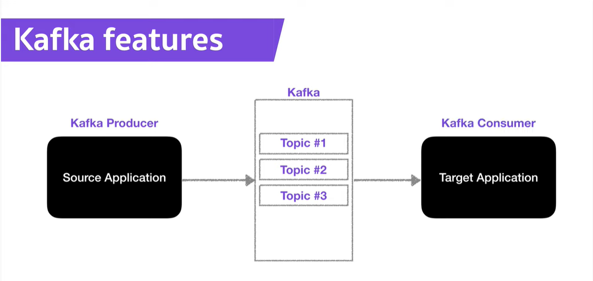
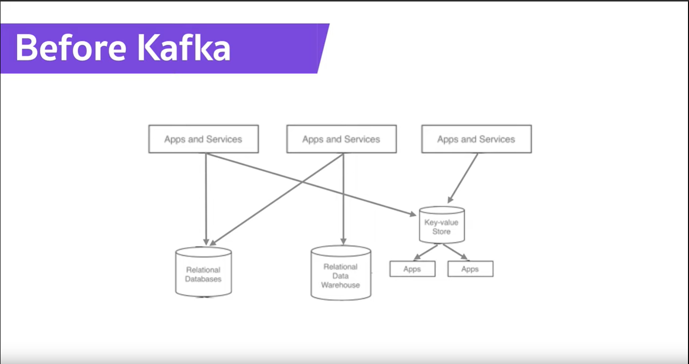
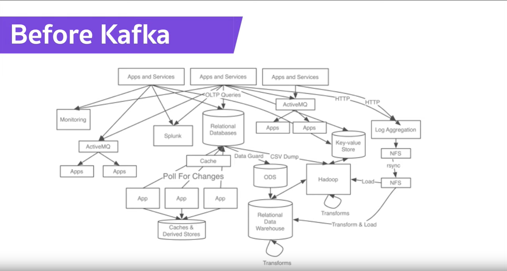
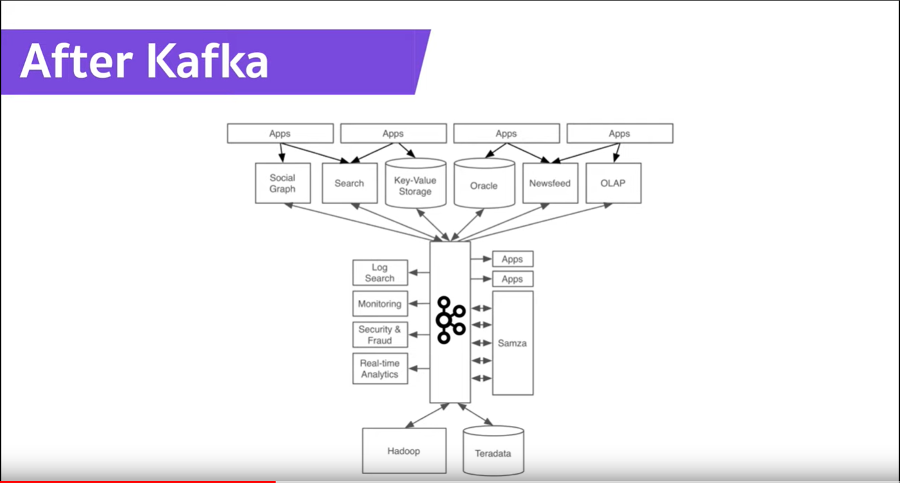

# **KAFKA**
## **개요**
## kafka 란 무엇인가?

아파치 재단의 카프카는 **pub-sub** 모델의 메세지 큐이고, 분산환경에 특화되어 설계되어 있다는 특징을 가짐으로써, 기존의 rabbitMQ 와 같은 메세지 큐와의 성능 차이가 난다.(훨씬 빠르게 처리)

그 외에도 클러스터 구성, faile-over, replication와 같은 여러가지 특지이 있다.

- - -

## **Pub-Sub** 모델 

카프카는 pub-sub(발행-구독) 모델을 사용하기 떄문에, 발행/구독모델이 무엇인지 알아야한다.

pub-sub은 메세지를 특정 수신자에게 직접적으로 보내주는 시스템이 아니다.

publisher는 메세지를 topic을 통해서 카테고리화한다.

분류된 메세지를 받기를 원하는 receiver는 그 해당 topic을 구독(subscriber) 함으로써 메세지를 읽어올 수 있다.

**아래의 그림에서는 Producer 가 publisher 이며 Consumer 를 subscriber 로 보면 된다.**

즉, publisher는 topic에 대한 정보만 알고 마찬가지로 subscriber 도 topic만 바라본다.
publisher와 subscriber 서로 모르는 상태다.

간단하게 구조와 기존의 어플리케이션 구조와 kafka를 쓰는 어플리케이션의 구조를 아래의 그림으로 설명하겠다.

예전의 프로그램 설계시 App and services 가 직접적으로 DataBase나 혹은 다른 target app에 붙어서 사용을 했다

점차 기술과 하드웨어, 서비스의 규모의 발달로 App and Service 의 갯수와 규모가 커져 아래와 같은 복잡한 구조가 되어간다.

위 그림과 같이 복잡한 구조로 하나의 변화로 전체를 다 수정을 해야될 수 있을 정도로 유지보수가 너무 어려워졌다.

## **하지만 아래와 kafka를 사용시 아래와 같은 구조로 변화된다.**

이렇게 apach kafka 는 내부의 복잡함을 해결하기 위해 개발을 하였고 사용을 하게 된다.

실제 어플리케이션은 kafka만 알고 있으면 되고, taget app 또한 kafka 에서 데이터를 받아오면 된다.

- - -

## kafka 의 구성요소

* topic, partision
* Producer, Consumer
* broker, zookkeepr
* consumet, grop
* repliction

구성요소에 대한 자세한 내용은 아래의 블로그를 참고하자.

 - [kafka informaion](https://medium.com/@umanking/%EC%B9%B4%ED%94%84%EC%B9%B4%EC%97%90-%EB%8C%80%ED%95%B4%EC%84%9C-%EC%9D%B4%EC%95%BC%EA%B8%B0-%ED%95%98%EA%B8%B0%EC%A0%84%EC%97%90-%EB%A8%BC%EC%A0%80-data%EC%97%90-%EB%8C%80%ED%95%B4%EC%84%9C-%EC%9D%B4%EC%95%BC%EA%B8%B0%ED%95%B4%EB%B3%B4%EC%9E%90-d2e3ca2f3c2)

---

