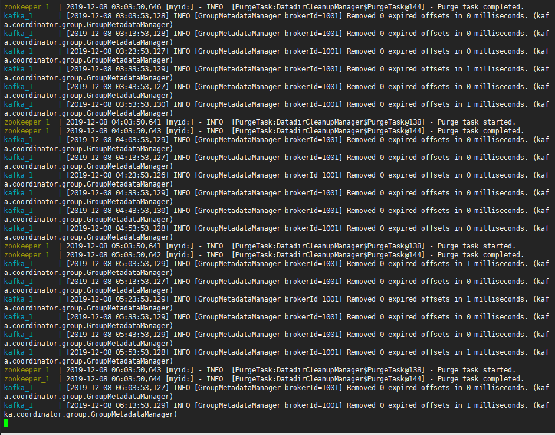
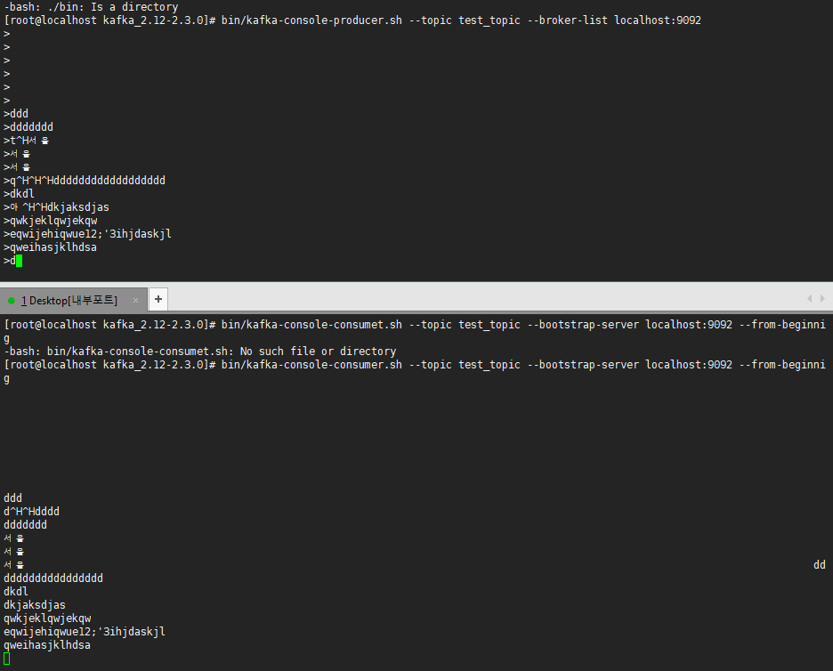

# **Docker-compose 를 이용하여 local에 Kafka 구축하기**


- - -

## **환경 사항**

  * Server 설정
    + Centos 7 
    + JAVA openjdk version "1.8.0_232"
    + docker-compose version 2
 

- - -

## docker-compose install 

```

  # yum install -y yum-utils device-mapper-persistent-data lvm2
  # yum-config-manager --add-repo https://download.docker.com/linux/centos/docker-ce.repo
  # yum install docker-ce -y
  # systemctl start docker

```

## Kafka 설치 및 테스트 

### 내장된 Zookeeper 를 사용하여 구축

```

# git clone https://github.com/wurstmeister/kafka-docker

# cd kafka-docker

```

docker-compose-single-broker.yml 설정 파일

```

version: '2'
services:
  zookeeper:
    image: wurstmeister/zookeeper
    ports:
      - "2181:2181"
  kafka:
    build: .
    ports:
      - "9092:9092"
    environment:
      KAFKA_ADVERTISED_HOST_NAME: 127.0.0.1
      KAFKA_CREATE_TOPICS: "test:1:1"
      KAFKA_ZOOKEEPER_CONNECT: zookeeper:2181
    volumes:
      - /var/run/docker.sock:/var/run/docker.sock


```

KAFKA_ADVERTISED_HOST_NAME: 를 로컬에서 사용할 시 127.0.0.1 로 바꾸어준다.

**실행명령어**

```
start cmd
  # docker-compose -f docker-compose-remote-zk.yml up

stop cmd
  # docker-compose -f docker-compose-remote-zk.yml down
```

위 명령어를 실행하면 아래와 같은 화면이 생긴다.



- - -

## **Test topic 해보기**


  - [Kafka Test file download](https://kafka.apache.org/quickstart)

  다운로드 버튼을 눌러서 위 파일을 다운로드 받는다.

  ```
  
    wget http://mirror.navercorp.com/apache/kafka/2.3.0/kafka_2.12-2.3.0.tgz
    tar xzvf kafka_2.12-2.3.0.tgz
    cd kafka_2.12-2.3.0
  
  ```

  shell 창을 세개를 켜두고 아래와 같은 명령어를 실행 
  
  1. 토픽생성
  ```
  # sh bin/kafka-topics.sh  --create --topic test_topic --zookeeper localhost:2181 --partitions 1 --replication-factor 1

  ```

    - crate : 토픽 생성
    - topic : 생성할 토픽 명, 위 명령어에서는 test_topic
    - zookeeper : 주키퍼가 실행중인 호스트, 로컬에 구축을 했다면 localhost:2181 을 적고, 별도의 서버에 구축했다면 server_ip:2181 을 적으면 된다.
    - partitions : 생성할 토픽의 파티션 갯수.
    - replication-factor : 생성할 토픽의 본사본의 갯수.

  2. producer
  ```
    # bin/kafka-console-producer.sh --topic test_topic --broker-list localhost:9092

  ```

  3. consumer

  ```
  # bin/kafka-console-consumer.sh --topic test_topic --bootstrap-server localhost:9092 --from-beginning

  ```

  확인
  


  
