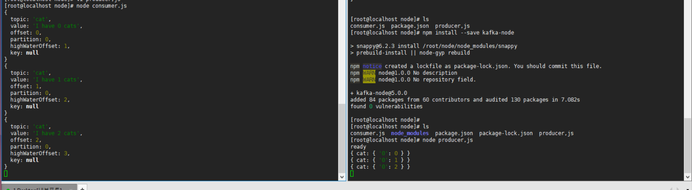

# kafka-node 패키지를 이용하여 kafka 사용 확인


사용전 카프카의 개념.

producer <-> kafka <-> consumer

producer 와 consumer 는 서로 직접적으로 연결을 하지 않고 kafka만 보고 있으면 된다.

kafka에는 특정 topic을 생성해야 되며 쉽게 카테고리를 나눈다고 생각하면 된다.

kafka [ topic{로그}, , topic{cat}, topic{이미지}  ] 형태로 나뉘어져 있으며, 각각 필요한 토픽에 메시지를 던지면 된다.


1. kafka topic 생성

  cat 이라는 토픽을 생성해준다.

  ```
    * topic 생성
      # sh bin/kafka-topics.sh  --create --topic cat --zookeeper localhost:2181 --partitions 1 --replication-factor 1

    * 리스트확인
      # sh bin/kafka-topics.sh --list --zookeeper localhost:2181

      리스트 확인시 cat 이라는 토픽리스트가 나오면 정상적으로 생성이 된 것 이다..

  ```
2. 패키지 다운로드
  ```  
  npm install --save kafka-node

  ``` 
3. producer.js 코드
  ```
  var kafka = require("kafka-node");
  Producer = kafka.Producer,
  client = new kafka.KafkaClient({kafkaHost:'172.30.1.16:9092'}),
  producer = new Producer(client);

  let count = 0;

  producer.on("ready", function() {
    console.log("ready");
    setInterval(function() {
      payloads = [
        { topic: "cat", messages: `I have ${count} cats`, partition: 0 }
      ];

      producer.send(payloads, function(err, data) {
        console.log(data);
        count += 1;
      });
    }, 5000);
  });

  producer.on("error", function(err) {
    console.log(err);
  });

  ```

3. consumer.js 코드
   
  ```

  var kafka = require("kafka-node"),
  Consumer = kafka.Consumer,
  client = new kafka.KafkaClient({kafkaHost:'172.30.1.16:9092'}),
  consumer = new Consumer(client, [{ topic: "cat", partition: 0 }], {
    autoCommit: false
  });

  consumer.on("message", function(message) {
  console.log(message);

  /** { topic: 'cat', value: 'I have 385 cats', offset: 412, partition: 0, highWaterOffset: 413, key: null } */

  });

  ```

  ## 실행화면 
  

